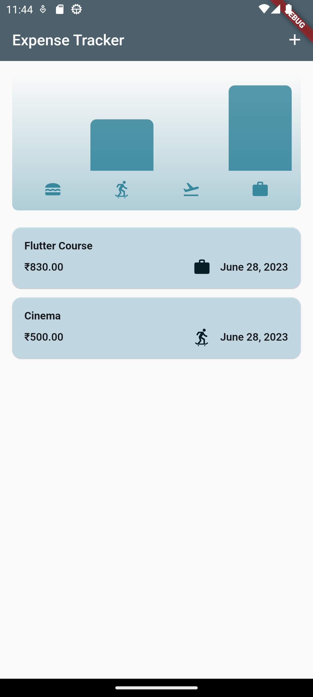
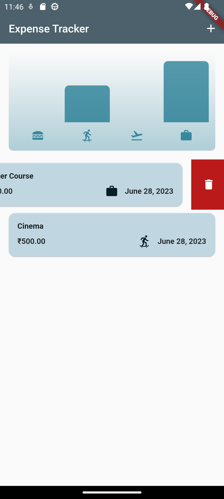
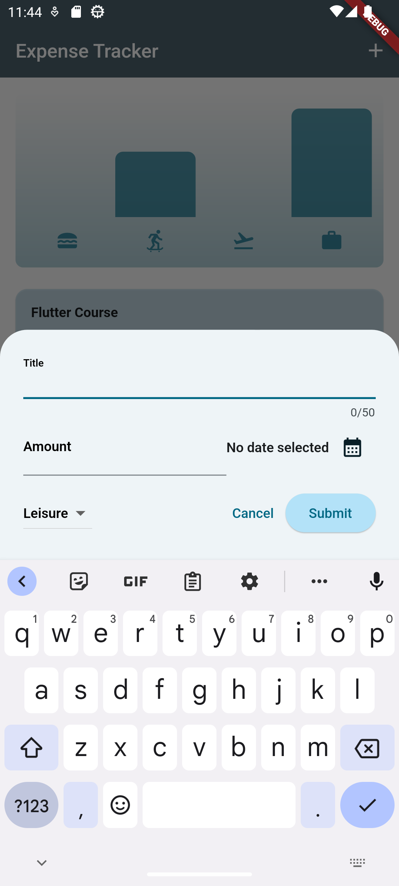
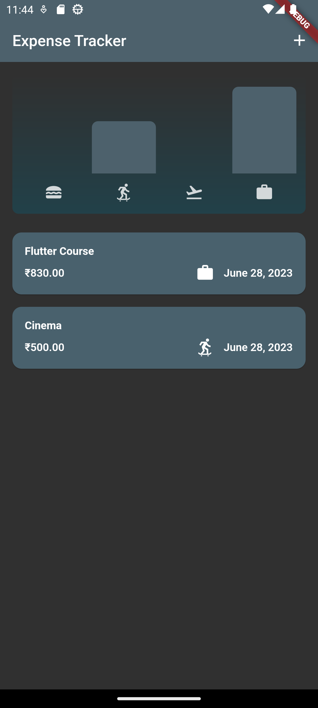
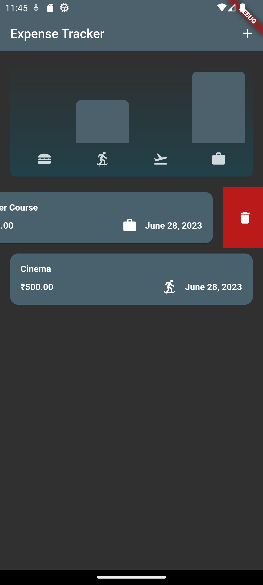
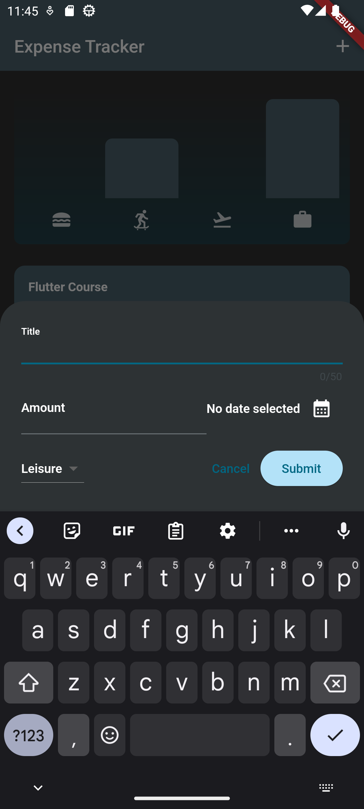

# Expense Tracker

Created a Flutter expense tracker app that is both simple and effective. It makes it easy to log your expenses and provides charts to help you track your spending habits.

---

## :iphone: Screenshots

